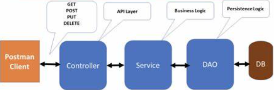
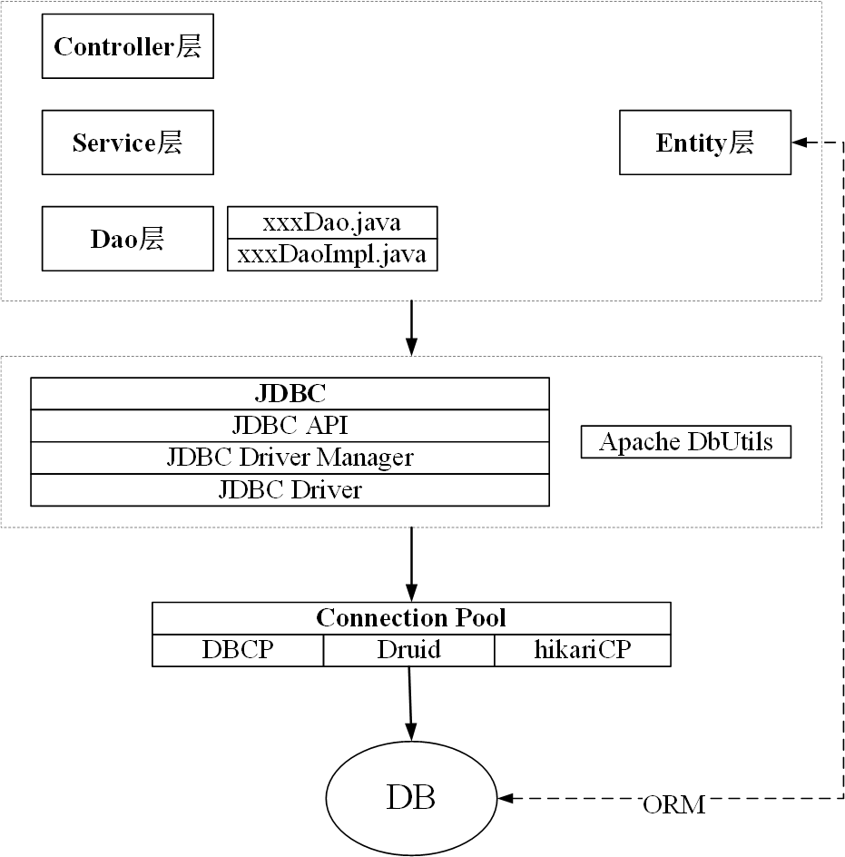

# JDBC part 2

### 9. DAO 设计模式

> Database Access Object: 数据库访问(存取)对象，专门用于业务逻辑层与持久化数据之间，实现持久化数据的访问。专门与数据库打交道的层。所谓 DAO 层是从系统分层结构出发，把数据存取操作集中到DAO层，以便于维护和逻辑清。

ORM: Object Relation Mapping, 对象关系映射，即将关系型数据库中的记录和面向对象编程中的对象，进行映射操作；



#### DAO 入门操作 ❤️ 

1. 创建一个实体对象，对应数据库表的所有字段，用来承载数据库表中的数据的；

   > 分层是为了应对业务逻辑更加复杂的场景，各层之间传递的数据对象：可以叫做 domain / model / entity / pojo
   >
2. 创建 xxxDAO 接口
3. 创建 xxxDAO 接口实现类 xxxDaoImpl

进阶: public class BaseDao < T>

思路：将公共方法提取到 BaseDao类中， 并利用反射，获取泛型，操作数据实体。由此，不同的 xxxDAOImpl 实现类可以继承自 BaseDao类(提供公共方法), 并实现 xxxDao 接口(规定特殊方法)；例如：

```java
public class UserDaoImpl extends BaseDao<User> implements UserDao{}
```

### 10. JDBC 事务管理

> ACID 是数据库事务处理的基本原则，它代表了四个关键属性：原子性（Atomicity）、一致性（Consistency）、隔离性（Isolation）和持久性（Durability）。这些属性保证了数据库操作的可靠性和数据的一致性。

事务: ACID特性

> 对于DDL，数据定义语言无效，DDL一旦执行，就会自动提交；setAutoCommit(false),无效 ❤️

如果 JDBC 连接处理，默认情况下，自动提交模式。每个 SQL 语句在完成后都会提交到数据库中；对于特殊情况，需要关闭自动提交，管理自己的事务。

- 提高性能;
- 保持业务流程的完整性;
- 使用分布式程序保证事务;

#### （1）操作流程

- 开启事务：connection.setAutoCommit(false); 关闭自动提交
- 提交事务：connection.commit();
- 回滚事务：connection.rollback(); 若中间发生了错误中断程序导致没有提交，也需要回滚，因为有缓存的

```java
public class TestTransaction {
    public static void main(String[] args) {
        Connection connection = DBUtil.getConnection();
        Statement statement = null;
        try {
            // 开启事务
            connection.setAutoCommit(false);
            // sql1
            String sql1 = "insert into user values('1234', 5678)";
            statement = connection.createStatement();
            statement.executeUpdate(sql1);
//            int e = 10 /0; // 异常
            // sql2
            String sql2 = "insert into user values('5678', 1234)";
            statement = connection.createStatement();
            statement.executeUpdate(sql2);
            // 提交事务
            connection.commit();
        } catch (SQLException e) {
            try {
                // 回滚事务
                connection.rollback();
            } catch (SQLException ex) {
                throw new RuntimeException(ex);
            }
            throw new RuntimeException(e);
        } finally {
            DBUtil.close(connection);
            DBUtil.close(statement);
        }
    }
}
```

#### （2）事务保存点 SavePoint

- 有时候一个事务可能是一组复杂的语句，因此可能要回滚到某个特殊点。
- 保存点帮我们在事务中创建这个点，让程序回滚到指定点。
- 在程序中可以设置多个保存点。
- 当事务提交或者事务回滚后，为事务产生的任何保存点都会自动释放并变为无效。
- 把事务回滚到一个保存点，会使其他所有保存点自动释放并变为无效。
  - 在事务中创建保存点
  - 异常中捕捉保存点并回滚到保存点

> 回滚到保存点，但并不提交。只有再次调用 commit(),使得保存点之前的操作提交；

```java
public class TestSavePoint {
    public static void main(String[] args) {
        Connection connection = DBUtil.getConnection();
        Statement statement = null;
        // 保存点
        Savepoint savepoint = null;
        try {
            // 开启事务
            connection.setAutoCommit(false);
            // sql1
            String sql1 = "insert into user values('1111', 1111)";
            statement = connection.createStatement();
            statement.executeUpdate(sql1);
            savepoint = connection.setSavepoint(); // 设置一个保存点
            int e = 10 /0; // 异常
            // sql2
            String sql2 = "insert into user values('2222', 2222)";
            statement = connection.createStatement();
            statement.executeUpdate(sql2);
            // sql3
            String sql3 = "insert into user values('3333', 3333)";
            statement = connection.createStatement();
            statement.executeUpdate(sql3);
            // 提交事务
            connection.commit();
        } catch (Exception e) {
            try {
                // 回滚事务
//                connection.rollback();
                connection.releaseSavepoint(savepoint); // 回滚到保存点，但并不提交
                connection.commit();
            } catch (SQLException ex) {
                throw new RuntimeException(ex);
            }
            throw new RuntimeException(e);
        } finally {
            DBUtil.close(connection);
            DBUtil.close(statement);
        }
    }
}
```

#### （3）事务对于DDL，数据定义语言无效

> DDL一旦执行，就会自动提交；setAutoCommit(false),无效 ❤️

```java
public class TestDDL {
    public static void main(String[] args) {
        Connection connection = DBUtil.getConnection();
        Statement statement = null;
        try {
            // 开启事务
            connection.setAutoCommit(false);
            // sql
            String sql = "create table fuck(id int)";
            statement = connection.createStatement();
            int i = statement.executeUpdate(sql);
            int x = 10 / 0; // 制造异常
            // sql1
            String sql1 = "create table shit(id int)";
            statement = connection.createStatement();
            int i1 = statement.executeUpdate(sql1);
            // 提交事务
            connection.commit();
        } catch (Exception e) {
            try {
                // 回滚事务
                connection.rollback(); // 对于DDL语句。回滚无效，且永远自动提交
            } catch (SQLException ex) {
                throw new RuntimeException(ex);
            }
            e.printStackTrace();
        } finally {
            DBUtil.close(connection);
            DBUtil.close(statement);
        }
    }
}
```


### 11. Apache DbUtils 工具类

> Commons DbUtils 是 Apache 软件基金组织提供的一个对 JDBC 进行简单封装的开源工具类库，简化 JDBC 应用程序的开发，同时也不会影响程序的性能，是一个小巧简单实用的工具。

- 对于数据表的读操作，可以把结果转换成List、Array、Set 等java集合，便于程序员操作;
- 对于数据表的写操作，只需要写 sql 和传参数就可以;
- 可以使用数据源、数据库连接池技术、直连获取连接;

#### （1）下载地址

> https://repo1.maven.org/maven2/commons-dbutils/commons-dbutils/1.7/commons-dbutils-1.7.jar

下载后添加为库，并导入模块依赖

#### （2）使用

```java
public class Test {
    public static void main(String[] args) throws SQLException {
        Connection connection = DBUtil.getConnection();
        QueryRunner queryRunner = new QueryRunner();
        // 插入
//        String sql1 = "insert into user values(?,?)";
//        int update = queryRunner.update(connection, sql1, "5555", 5555);
//        System.out.println(update > 0 ? "成功" : "失败");

        // 查询一条
//        String sql2 = "select * from user where id=?";
//        BeanHandler<User> beanHandler = new BeanHandler<>(User.class);
//        User query = queryRunner.query(connection, sql2, beanHandler, "1111");
//        System.out.println(query);

        // 查询多条
//        String sql3 = "select * from user";
//        BeanListHandler<User> beanListHandler = new BeanListHandler<>(User.class);
//        List<User> query = queryRunner.query(connection, sql3, beanListHandler);
//        query.stream().forEach(System.out::println);

        // 特殊查询 (对于无法封装数据对象的结果查询)
        String sql4 = "select count(*), max(name) from user";
        MapHandler handler = new MapHandler();
        Map<String, Object> query = queryRunner.query(connection, sql4, handler);
        query.forEach((k,v)->{
            System.out.println(k + "----" + v);
        });
    }
}
```


### 总结

---


