# JDBCLearning

# JDBC part 1


数据持久化处理：

1. 存储磁盘文件，使用IO流；
2. 存储在网络上；
3. 存储在数据库中；(常用)

### 0. 简介

Java DataBase Connectivity：JDBC，称为Java数据库连接。它是一种用于数据库访问的应用程序API,由一组用Java编写的类和接口组成。是Java语言中用来**规范**客户端程序如何访问数据库的应用程序接口。

> 使用JDBC技术，可以用统一的语法对多种数据库进行访问，而不用担心数据库操作语言的差异。❤️

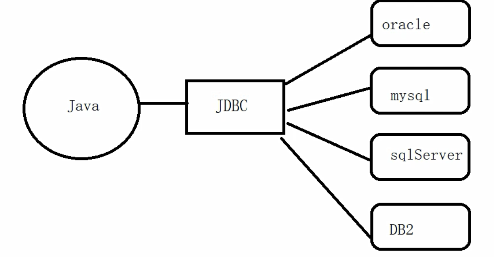

#### （1）JDBC 体系结构

JDBC的结构可以划分为两层：

- 面向底层的 JDBC Driver Interface((驱动程序管理器接口) （各个数据库厂商提供JAVA的，符合JDBC规范的驱动）
- 面向程序员的 JDBC API 👍

> JDBC API 使用动动程序管理器并指定数据库的驱动程序来提供与异构数据库的透明连接。
>
> JDBC 驱动管理器确保使用正确的驱动程序来访问每个数据源。驱动程序管理器能够支持连接到多个异构数据库的多个并发驱动程序。

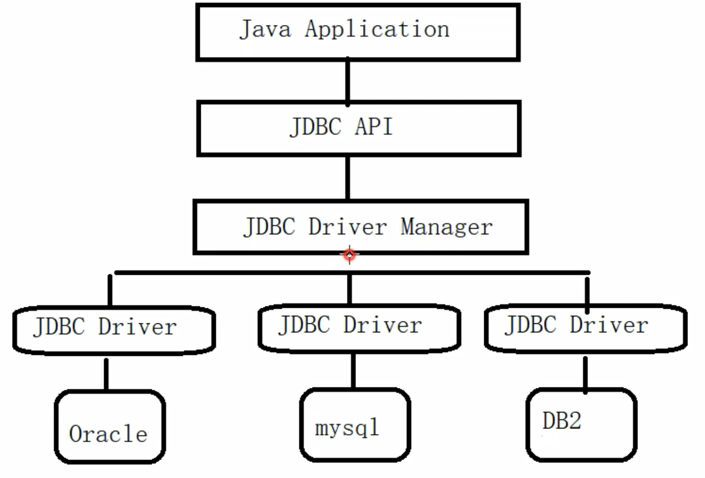

#### （2）相关 API

- Driver: 数据库厂商提供数据库的驱动；
- DriverManager: 驱动管理器，
  - 作用：注册驱动，让程序加载一下厂商提供的驱动；
  - 获取连接：有了连接之后，就可以操作数据库；
- Connection：连接，表示和数据库的连接对象，获取 Statement 对象，语句对象 CUDR；
- Statement：用来操纵SQL语句，发送给数据库去执行；
  - 执行增加、删除、修改，对数据库记录有影响的语句；
  - 执行查询，返回 ResultSet；
- ResultSet：结果集，用来封装查询结果；

#### （3）获取连接操作

1. 获取驱动：[mysqlconnectorjava8030.jar](assets/mysql-connector-java-8.0.30.jar)
   https://repo1.maven.org/maven2/

> https://repo1.maven.org/maven2/mysql/mysql-connector-java/5.1.48/

2. 导入库


> com.mysql.jdbc.Driver 是 mysql-connector-java 5中的;
>
> com.mysql.cj.jdbc.Driver 是mysql-connector-java 6 以及以上中的;

3. 获取连接

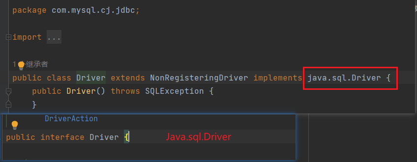

> com.mysql.cj.jdbc.Driver 实现了 java.sql.Driver 接口，后者是 JDBC 的规范，所以创建驱动对象的时候用 java.sql.Driver，便于更换与维护
>
> URL: `协议:数据库://地址:端口号/数据库名`, 例如：`jdbc:mysql://localhost:3306/JDBC`

##### a. 方式一：直接通过 Driver 接口的 connect 方法去获取连接

```java
    // 获取连接方式一
    public static void GetConnection1() throws SQLException {
        // com.mysql.cj.jdbc.Driver 实现了 java.sql.Driver 接口，后者是 JDBC 的规范，所以创建驱动对象的时候用 java.sql.Driver，便于更换与维护
        Driver driver = new com.mysql.cj.jdbc.Driver();
        Properties properties = new Properties();
        properties.setProperty("user", "root");
        properties.setProperty("password", "root");
        // 通过 java 连接数据库 协议
        // 协议:数据库://地址:端口号/数据库名
        String url = "jdbc:mysql://localhost:3306/JDBC";
        Connection connect = driver.connect(url, properties);
        System.out.println(connect);
    }
```

##### b. 获取连接方式二：通过反射方式静态加载驱动类

```java
    public static void GetConnection2() throws Exception {
        // 通过反射获取驱动的构造方法创建实例
        // 既如此，我们便可以在需要更换数据源时，直接更换传入的字符串（代表驱动类），也可以将该字符串（代表驱动类）写入到配置文件中，便于管理和维护
        Object o = Class.forName("com.mysql.cj.jdbc.Driver").getConstructor().newInstance();
        // 强转为 java.sql.Driver
        Driver driver = (Driver) o;
        Properties properties = new Properties();
        properties.setProperty("user", "root");
        properties.setProperty("password", "root");
        String url = "jdbc:mysql://localhost:3306/JDBC";
        Connection connect = driver.connect(url, properties);
        System.out.println(connect);
    }
```

##### c. 获取连接方式三：通过 DriverManager 获取连接

```java
    public static void getConnection3() throws Exception {
        Object o = Class.forName("com.mysql.cj.jdbc.Driver").getConstructor().newInstance();
        // 强转为 java.sql.Driver
        Driver driver = (Driver) o;
        DriverManager.registerDriver(driver);
        String url = "jdbc:mysql://localhost:3306/JDBC";
        Connection connection = DriverManager.getConnection(url, "root", "root");
        System.out.println(connection);
    }
```

##### d. 获取连接方式四：通过 DriverManager 获取连接 （静态代码块注册）

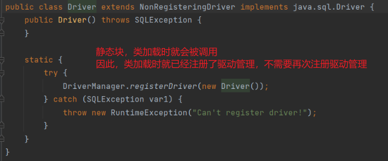

> com.mysql.cj.jdbc.Driver 有一个静态代码块，在类加载时会被执行，注册到驱动管理，因此不需要再次注册 ❤️

```java
    public static void getConnection4() throws Exception {
        // 提供URL地址
        String url = "jdbc:mysql://localhost:3306/JDBC";
        // 加载驱动
        // com.mysql.cj.jdbc.Driver 有一个静态代码块，在类加载时会被执行，注册到驱动管理，因此不需要再次注册
        Class.forName("com.mysql.cj.jdbc.Driver");
        // 获取连接对象
        Connection connection = DriverManager.getConnection(url, "root", "root");
        System.out.println(connection);
    }
```

e. 获取连接方式五：读取配置文件 ❤️

> 标准获取连接的方式 ❤️

```properties
# mysql config
mysql.user=root
mysql.password=root
mysql.driver=com.mysql.cj.jdbc.Driver
mysql.url=jdbc:mysql://localhost/JDBC
```

```java
    public static void getConnection5() throws Exception{
        // 读取配置文件
        ResourceBundle resourceBundle = ResourceBundle.getBundle("db");
        String user = resourceBundle.getString("mysql.user");
        String password = resourceBundle.getString("mysql.password");
        String url = resourceBundle.getString("mysql.url");
        String driver = resourceBundle.getString("mysql.driver");
        // 加载驱动
        Class.forName(driver);
        // 获取连接
        Connection connection = DriverManager.getConnection(url, user, password);
        System.out.println(connection);
    }
```

#### （4）常见连接错误

1. mysql 服务没有启动

> com.mysql.cj,jdbc.exceptions.CommunicationsException: Communications link failure

2. 驱动类名错误

> java.lang.ClassNotFoundException: com.mysql.cj.jdbc.driver

3. 驱动包没有导入

> java.lang.ClassNotFoundException: com.mysql.cj.jdbc.Driver

4. 数据库名字错误：

> java.sql.SQLSyntaxErrorException: Unknown database 'testtest'

5. URL地址错误

> java.sqlSQLException: No suitable driver found for jdbc:oracle://localhost:3306/test
>
> The driver has not received any packets from the server.

6. 用户名或密码错误

> java.sql.SQLException: Access denied for user 'root'@'localhost'
>
> Access denied for user 'root1'@'ocalhost' (using password: YES)

### 1. Statement 语句对象

#### （1）获取 Statement 实现数据插入

> java.sql.Statement

> Statement statement = connection.createStatement();
>
> int i = statement.executeUpdate(sql); // 返回整数表示，影响了几行数据

#### （2）或取 Statement 实现数据查询

##### a. Resultset 结果集

> - 用来封装查询的结果。
> - 最开始，结果集的指针指向第一条数据之前(库顶)的位置。
> - 通过调用next方法来判断是否有下一条数据，如果有下一条数据，则指针向下移动一位。
> - 整体上对于结果集，可以使用循环遍历。

```java
public class TestStatement {
    public static void main(String[] args) throws Exception {
//        insert();
        query();
    }

    public static Connection connect() throws Exception {
        // 读取配置文件
        ResourceBundle bundle = ResourceBundle.getBundle("db");
        String user = bundle.getString("mysql.user");
        String password = bundle.getString("mysql.password");
        String url = bundle.getString("mysql.url");
        String driver = bundle.getString("mysql.driver");
        // 加载驱动
        Class.forName(driver);
        // 获取连接
        Connection connection = DriverManager.getConnection(url, user, password);
        return connection;
    }
    public static void insert() throws Exception {
        // 获取连接
        Connection connect = connect();
        // 获取语句对象
        Statement statement = connect.createStatement();
        // 从键盘输入数据
        Scanner sc = new Scanner(System.in);
        System.out.println("请输入员工编号:");
        String code = sc.next();
        System.out.println("请输入员工姓名:");
        String name = sc.next();
        System.out.println("请输入员工年龄:");
        String age = sc.next();
        // 拼接 SQL 语句
        String sql = "INSERT INTO employees (code, name, age) VALUES ('" + code + "', '" + name + "', " + age + ")";
        // executeUpdate() 主要执行DML语句（DDL语句也可以执行） execute 都可以执行
        // 插入操作
        int i = statement.executeUpdate(sql); // 返回整数表示，影响了几行数据
        if(i>0){
            System.out.println("Successfully! " + i + "row(s) affected");
        } else {
            System.out.println("failed!");
        }
        // 关闭资源
        sc.close();
        statement.close();
        connect.close();
    }

    public static void query() throws Exception {
        // 获取连接
        Connection connect = connect();
        // 获取语句对象
        Statement statement = connect.createStatement();
        // 查询操作
        String selectSql = "select * from employees";
        // executeQuery() 主要执行DQL数据查询语言
        ResultSet resultSet = statement.executeQuery(selectSql); // 返回结果集
        // 打印表头
        System.out.println("id" + "\t" + "code" + "\t" + "name" + "\t" + "age" + "\t" + "gender" + "\t" + "salary" + "\t" + "dept_id");
        // 打印数据
        while (resultSet.next()){
            System.out.print(resultSet.getInt(1) + "\t"); // 列索位置引从 1 开始
            System.out.print(resultSet.getString(2) + "\t");
            System.out.print(resultSet.getString(3) + "\t");
            System.out.print(resultSet.getInt(4) + "\t");
            System.out.print(resultSet.getInt(5) + "\t");
            System.out.print(resultSet.getDouble(6) + "\t");
            System.out.print(resultSet.getInt(7) + "\t");
            System.out.println("\n");
        }
        // 关闭资源
        resultSet.close();
        statement.close();
        connect.close();
    }
}
```

> 操作 JDBC 的步骤：❤️
>
> 1. 提供连接数据库的 URL 地址
> 2. Class.forName 加载驱动；
> 3. 获得连接对象 DriverManager.getconnection()；
> 4. 获取语句对象 Statement；
> 5. 操纵sql语句，执行 CRUD；
> 6. 操纵结果集对象 Resultset；
> 7. 关闭资源；
> 8. 处理异常 SQLException；

### 2. SQL 注入攻击 ❤️

#### （1）模拟登陆业务逻辑

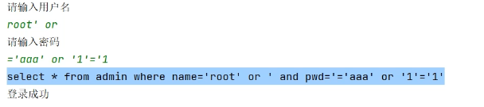

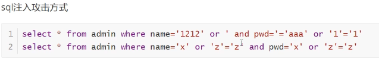

> SQL 注入攻击的产生，是由于使用 SQL 语句拼接的方式进行查询，其中的参数位置通过**字符串拼接**的方式形成 SQL 语句，可能导致特殊的语法使得命中查询

原因：SQL 语句拼接

#### （2）解决 SQL 攻击：PreparedStatement 预编译的方式获得 SQL 语句 ❤️

> - PreparedStatement 接口继承自 Statement 接口，表示预编译的 SQL 语句对象
> - `PreparedStatement preparedStatement = connection.prepareStatement(sql_model)` 允许接收一个带有参数缺省位（?）的SQL字符串
>   > String sql_model = "insert into employees (code, name, age) values (?, ?, ?)";
>   >
> - `preparedStatement.setString(1, code);` 的方法传递参数

> - 预编译带有缺省位（?）的 SQL 字符串，？位置的参数时固定的，不会产生因拼接而产生的歧义；
> - SQL 模板编译后可以多次使用，比如一次插入多条数据，只要参数位置对得上；

```java
public class TestPreparedStatement {
    public static void main(String[] args) {
        Connection connection = DBUtil.getConnection();
        String sql_model = "insert into employees (code, name, age) values (?, ?, ?)";
        try {
            // 预编译的方式获得 SQL 语句对象，需要先获得 SQL语句 模板
            PreparedStatement preparedStatement = connection.prepareStatement(sql_model);
            // 从键盘获取数据
            Scanner sc = new Scanner(System.in);
            System.out.println("输入编号：");
            String code = sc.next();
            System.out.println("输入姓名：");
            String name = sc.next();
            System.out.println("输入年龄：");
            String age = sc.next();
            // 填入数据; 参数索引位置从1开始
            preparedStatement.setString(1, code);
            preparedStatement.setString(2, name);
            preparedStatement.setString(3, age);
            int i = preparedStatement.executeUpdate();
            if(i>0){
                System.out.println("插入成功！");
            } else {
                System.out.println("插入失败！");
            }
            // 一个模板，多次插入
            preparedStatement.setString(1, "1030");
            preparedStatement.setString(2, "李火旺");
            preparedStatement.setString(3, "23");
            i = preparedStatement.executeUpdate();
            if(i>0){
                System.out.println("插入成功！");
            } else {
                System.out.println("插入失败！");
            }
            // 关闭资源
            preparedStatement.close();
            connection.close();
        } catch (SQLException e) {
            throw new RuntimeException(e);
        }
    }
}

```

### 3. UUID的使用

UUID：Universally Unique Identifier，通用唯一识别码；是一种在分布式系统中生成唯一标识符的方法。UUID 通常用于确保不同系统之间生成的标识符是唯一的，即使这些系统之间没有直接通信。

> UUID 的特点：
>
> - 唯一性：每个 UUID 都是唯一的，几乎不可能出现重复;
> - 无序性：UUID 之间没有固定的顺序关系;
> - 跨平台：UUID 在不同的操作系统和编程语言中都可以生成和识别;
> - 长度固定：标准的 UUID 由 32 个十六进制数字组成，通常分为五个部分显示，格式为 8-4-4-4-12 的 16 进制数字组合;

数据库设计中，主键的选择：（每个数据项都有一个主键字段）

> 1. 自然主键：跟业务逻辑有关，如学号；
> 2. 代理主键：与业务逻辑无关
>    1. 自动增长；（不安全）
>    2. 随机唯一；（重复概率极小）

```java
public class TestUUID {
    public static void main(String[] args) {
//        System.out.println(UUID.randomUUID().toString()); // 7ddfef2b-b213-4a97-a7ce-0313457ec5f3
        String sql = "insert into uuid values(?,?)";
        for (int i = 0; i < 100; i++) {
            DBUtil.executePreparedUpdate(sql, UUID.randomUUID().toString().replace("-",""), i);
        }
    }
}
```

### 4. MySQL 数据类型与 Java 数据类型的对应关系

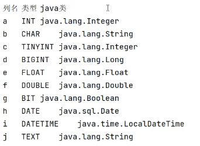

> getstring()方法的通用性: 😕(用于读取数据)
>
> getstring()//通用方法,可以获取所有数据类型。适用于显示，所有的数据通过这种方法获取，都变成字符了，如果想要获取后再做其他计算，不能使用该通用方法

### 5. Mysql 的 BLOB 数据类型

MySQL中，使用 BloB 这种数据类型操纵二进制对象，它是一个可以存储大量数据的容器(图片、音乐、视频、文件等),能容纳不同大小的数据。

> 在 mysql 数据库中，有四种 BloB 类型:
>
> - TinyBlob类型: 最大能容纳 255B 的数据;
> - Blob类型: 最大能容纳 65KB 的数据;
> - MediumBlob类型: 最大能容纳 16MB 的数据;
> - LongBlob类型: 最大能容纳 4GB 的数据;

在安全性要求更高的系统中，一般会使用 BloB 类型存储:

> - 缺点：占用空间较大、如果数据比较大，导致数据库性能下降
> - 优点：安全性更高

#### （1）插入 BLOB 数据类型

只能使用 PreparedStatement 预编译参数占位的方式；（因为无法完成SQL字符串拼接）

> 出现如下异常：👍
>
> Packet for query is too large (6,389,101 > 4,194,304). You can change this value on the server bysetting the 'max allowed packet' variable.
>
> 原因：设置 MediumBlob 后最大存储16M，但是每个包大小上线是4M，所以这里报错；
>
> 解决：修改mysql配置文件my.ini文件，配置max_allowed_packet选项；`max_allowed_packet=16777216`

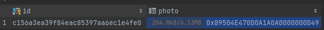

```java
    public static void insert() throws FileNotFoundException {
        // BLOB 数据插入
        String sql = "insert into profile values(?, ?)";
        String id = UUID.randomUUID().toString().replace("-", "");
        FileInputStream fileInputStream = new FileInputStream("resource/image/5.png");
        int i = DBUtil.executePreparedUpdate(sql, id, fileInputStream);
        System.out.println(i>0?"成功！":"失败");
    }
```

#### （2）查询读取 BLOB 数据类型

```java
    public static void query() throws SQLException, IOException {
        // BLOB 数据读取
        String sql = "select * from profile where id=?";
        String id = "6b61ce4817da459b814dc57b27f902ba";
        DBObject dbObject = DBUtil.executePreparedQuery(sql, id);
        ResultSet resultSet = dbObject.getResultSet();
        while (resultSet.next()) {
            System.out.println(resultSet.getString(1));
            Blob blob = resultSet.getBlob(2);
            InputStream binaryStream = blob.getBinaryStream(); // 返回输入流
            FileOutputStream fileOutputStream = new FileOutputStream("resource/image/6.jpg");
            byte[] bytes = new byte[1024];
            int len;
            while ((len = binaryStream.read(bytes)) != -1) {
                fileOutputStream.write(bytes, 0, len);
            }
            // 关闭流
            binaryStream.close();
            fileOutputStream.close();
        }
        // 关闭资源
        DBUtil.close(dbObject);
    }
```

### 6. JDBC 批处理操作

> 批处理: 不是一个一个的处理要执行的语句，按批次去执行。当有十条sql语句要执行，一次向服务器发送一条sql去执行，效率是比较低的。处理的方案是使用批处理，一次向服务器发送多条sql语句，由服务器一次性处理。

批处理针对数据更新(增加、删除、修改)语句，不处理查询的。

#### （1）Statement 批处理

相关方法：

- void addBatch(String sql): 添加sql语句到批次中；
- int[] executeBatch(): 执行批处理，返回影响行数数组；

> - 当执行了批次之后，批次中的SQL语句就会被清空。再次调用执行批次时，之前在批次中的sql语句已经没有了。所以，相当于没有执行成功。😕
> - 当批次中出现错误，后序的sql还是可以正常执行。😄

- void clearBatch(): 清空已经添加到批次中的 SQL 语句；

```java
public class TestStatementBatch {
    public static void main(String[] args) throws SQLException {
        Connection connection = DBUtil.getConnection();
        Statement statement = connection.createStatement();
        // 批量插入10条数据
        for (int i = 0; i < 10; i++) {
            String id = UUID.randomUUID().toString().replace("-", "");
            String sql = "INSERT INTO user VALUES ('" + id + "', " + i + ")";
            statement.addBatch(sql);
        }
        int[] ints = statement.executeBatch();
        System.out.println(Arrays.toString(ints));
        DBUtil.close(connection);
        DBUtil.close(statement);
    }
}
```

#### （2）PreparedStatement 批处理

> 每个 PreparedStatement 对象都绑定一条 SQL 模板，向 PreparedStatement 中添加批次操作，实际不是填加 sql 语句，而是为问号占位赋值。

##### 提高批处理效率的两个点：❤️❤️❤️❤️❤️

1. 手动提交 ❤️

> 必须将自动提交关闭，数据处理异常回滚时可保证提交前的操作处于同一事务，保证回滚成功。

- connection.setAutoCommit(false): 将自动提交设为假；默认 true 为自动提交，若为自动提交，每执行一条语句就提交一次，效率较低；
- connection。commit(): 手动提交，可以等批次每一条语句都执行完毕，统一提交一次，效率较高；

2. 设置连接参数 ❤️

mysql的 jdbc 驱动默认情况下，无视 executeBatch() 语句。希望使用批次执行，在 url 地址后面加入 rewriteBatchedStatements=true 设置；

> 数据库连接URL添加参数：`jdbc:mysql://localhost:3306/JDBC?rewriteBatchStatements=true`；可以让数据库识别 JDBC 的批处理操作，实现真正的批处理

3. PreparedStatement 效率高于 Statement

```java
public class TestPreparedStatementBatch {
    public static void main(String[] args) throws SQLException {
        // 获取连接 jdbc:mysql://localhost:3306/JDBC?rewriteBatchStatements=true
        Connection connection = DBUtil.getConnection();
        connection.setAutoCommit(false); // 关闭自动提交
        // 提供 sql 模板
        String sql = "insert into user values(?,?)";
        // 获取 Statement
        PreparedStatement preparedStatement = connection.prepareStatement(sql);
        // 循环填入参数
        for (int i = 11; i < 201; i++) {
            preparedStatement.setString(1, UUID.randomUUID().toString().replace("-", ""));
            preparedStatement.setInt(2, i);
            preparedStatement.addBatch();
        }
        // 执行批次
        int[] ints = preparedStatement.executeBatch();
        System.out.println(Arrays.toString(ints));
        // 手动提交
        connection.commit();
        // 关闭资源
        DBUtil.close(connection);
        DBUtil.close(preparedStatement);
    }
}
```

### 7. 数据连接池

是一个容器，持有多个数据库连接。当程序需要操作数据库的时候，直接可以从池中取出连接，使用完成之后，再放回到池中。

> 1. 节省资源。如果每次访问数据库，都需要创建新的连接，在使用完成后，再去销毁连接，都是比较耗费系统资源的;
> 2. 响应更高效。节省了创建和销毁的时间;
> 3. 统一管理数据库连接，避免因为业务膨胀，导致数据库连接增多;
> 4. 对性能各方面进待监控;

市场上的连接池技术：

> 开源的连接池技术：
>
> 1. C3P0 (古老)
> 2. DBCP (DataBase Connection Pool)，是 tomcat 里 apache 提供的
> 3. Druid （阿里开源）👍
> 4. HiKariCP (Spring 默认，号称最快)

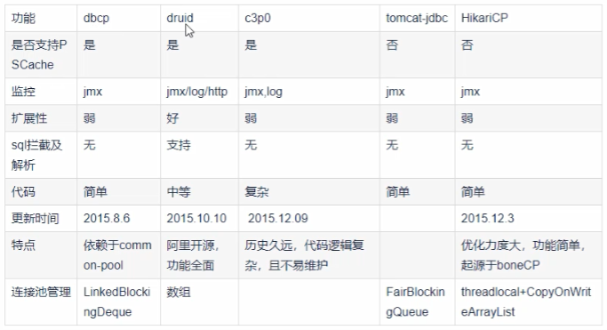

#### （1）Druid (德鲁伊)的使用

```java
public class TestDruid {
    public static void main(String[] args) throws SQLException {
        Connection connection;
        try (DruidDataSource druidDataSource = new DruidDataSource()) {
            // 连接配置
            druidDataSource.setDriverClassName("com.mysql.cj.jdbc.Driver");
            druidDataSource.setUrl("jdbc:mysql:/localhost:3306/JDBC");
            druidDataSource.setUsername("root");
            druidDataSource.setPassword("root");
            // 连接池配置
            druidDataSource.setInitialSize(5); // 连接池创建的时候，自动创建的数据库连接数量
            druidDataSource.setMinIdle(10); // 最小空闲连接数
            druidDataSource.setMaxActive(20); // 最大同时激活连接数量
            druidDataSource.setMaxWait(6000); // 最大等待时间，以毫秒为单位，-1表示无限等待

            // DruidPooledConnection 类实现了 Connection
            // DruidPooledConnection connection = druidDataSource.getConnection();
            connection = druidDataSource.getConnection();
        }
        System.out.println(connection);
    }
}
```

#### （2）HikariCP 的使用

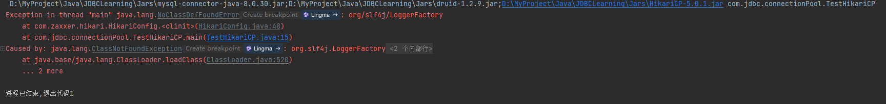

> 上述错误，表明 HikariCP 需要使用到其它库 slf4j 库，因此需要把 slf4j 库导入进来。（HikariCP库 依赖于 slf4j库）

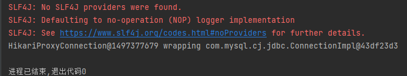

> 上述输出，连接成功，确实需要用到 slf4j 库；

```java
public class TestHikariCP {
    public static void main(String[] args) {
        try (HikariDataSource dataSource = new HikariDataSource()) {
            // 连接配置
            dataSource.setDriverClassName("com.mysql.cj.jdbc.Driver");
            dataSource.setJdbcUrl("jdbc:mysql://localhost:3306/JDBC");
            dataSource.setUsername("root");
            dataSource.setPassword("root");
            // 连接池配置
            dataSource.setMinimumIdle(10); // 最小空闲连接数

            Connection connection = dataSource.getConnection();
            System.out.println(connection);
        } catch (SQLException e) {
            throw new RuntimeException(e);
        }
    }
}
```

#### （3）在数据库工具类中使用连接池

反射 + 读取配置文件，获取连接后的操作与直接连接相同

（略）

### 8. 存储过程

> 存储过程: 在大型数据库系统中，一组为了完成特定功能的 SQL 语句集，它存储在数据库中，一次编译后永久有效。用户通过指定存储过程名字，并给出参数来执行。

优点: ❤️

- 重复使用: 从而减少数据库开发人员的工作量;
- 提高性能: 一旦编译成功后，下次再使用就不需要编译。一般的SQL语句，每执行一次需要编译一次，所以使用存储过程效率更高;
- 减少网络流量: 存储过程存储于数据库服务器上，调用的时候只需要传递存储过程名称及参数，降低网络传输的数据量;
- 安全性: 参数化的存储过程可以防止SQL注入攻击，而且可以将 Grant、Deny以及Revoke 权限应用于存储过程;

缺点：

- 移植性较差
- 不便于调式和维护

#### （1）使用JDBC调用存储过程

##### a. 无参数

- 创建存储过程

```sql
create procedure noparam()
begin
    select * from user;
end;
```

- 调用

```sql
call noparam();
```

- JDBC 调用无参存储过程

connection 调用 CallableStatement prepareCall(String sql) :

> CallableStatement 接口继承自 PreparedStatement 接口，PreparedStatement 接口继承自 Statement 接口；

❤️ 存储过程调用 SQL 字符串写法：`String sql = "{call noparam()}";`，语句两端加上大括号； ❤️

```java
public class TestNoParam {
    public static void main(String[] args) throws SQLException {
        // 获取连接
        Connection connection = DBUtil.getConnection();
        String sql = "{call noparam()}";
        CallableStatement callableStatement = connection.prepareCall(sql);
        boolean execute = callableStatement.execute(); // 调用存储过程无论是更新还是查询都可以
        ResultSet resultSet = callableStatement.getResultSet(); // 获取结果集
        while (resultSet.next()){
            System.out.println(resultSet.getString(1));
        }
        DBUtil.close(connection);
        DBUtil.close(callableStatement);
        DBUtil.close(resultSet);
    }
}
```

##### b. 有入参

- 创建存储过程

```sql
create procedure inparam(n int)
begin
    select * from user where name=n;
end;
```

- 调用

```sql
call inparam(2);
```

- JDBC 调用有入参存储过程

```java
public class TestInParam {
    public static void main(String[] args) throws SQLException {
        Connection connection = DBUtil.getConnection();
        String sql = "{call inparam(?)}";
        CallableStatement callableStatement = connection.prepareCall(sql);
        callableStatement.setInt(1, 2);
        boolean execute = callableStatement.execute();
        ResultSet resultSet = callableStatement.getResultSet();
        while (resultSet.next()){
            System.out.println(resultSet.getString(1));
        }
        DBUtil.close(connection);
        DBUtil.close(callableStatement);
        DBUtil.close(resultSet);
    }
}
```

##### c. 有出参

- 创建存储过程

```sql
create procedure outparam(in n int, out i varchar(50))
begin
    set i = (select id from user where name = n);
end;
```

- 调用

```sql
call outparam(2, @xx);
select @xx;
```

- JDBC 调用有出参存储过程

```java
public class TestOutParam {
    public static void main(String[] args) throws SQLException {
        Connection connection = DBUtil.getConnection();
        String sql = "{call outparam(?, ?)}";
        CallableStatement callableStatement = connection.prepareCall(sql);
        callableStatement.setInt(1, 2); // 入参
        // 对应out参数的处理，标注参数类型
        callableStatement.registerOutParameter(2, Types.VARCHAR);
        boolean execute = callableStatement.execute();
        String string = callableStatement.getString(2); // 出参
        System.out.println(string);
        DBUtil.close(connection);
        DBUtil.close(callableStatement);
    }
}
```

##### d. INOUT 参数

- 创建存储过程

```sql
create procedure inoutparam(inout x int)
begin
    set x = x*10;
end;
```

- 调用

```sql
set @x=5;
call inoutparam(@x);
select @x;
```

- JDBC 调用 INOUT 参数存储过程

```java
public class TestInOutParam {
    public static void main(String[] args) throws SQLException {
        Connection connection = DBUtil.getConnection();
        String sql = "{call inoutparam(?)}";
        CallableStatement callableStatement = connection.prepareCall(sql);
        callableStatement.setInt(1, 5);
        callableStatement.registerOutParameter(1, Types.INTEGER);
        callableStatement.execute();
        int anInt = callableStatement.getInt(1);
        System.out.println(anInt);
        DBUtil.close(connection);
        DBUtil.close(callableStatement);
    }
}
```

##### e. 返回多个结果集

- 构建存储过程

```sql
create procedure multi_result_set(x int)
begin
    select * from user where name=x;
    select * from user where name=2*x;
    select * from user where name=3*x;
end;
```

- 调用

```sql
call multi_result_set(2);
```

- JDBC 调用返回多个结果集存储过程

```java
public class TestMultiResult {
    public static void main(String[] args) throws SQLException {
        Connection connection = DBUtil.getConnection();
        String sql = "{call multi_result_set(?)}";
        CallableStatement callableStatement = connection.prepareCall(sql);
        callableStatement.setInt(1, 2);
        callableStatement.execute();
        ResultSet resultSet = callableStatement.getResultSet(); // 获取下一个结果集
        while (resultSet.next()){
            System.out.println(resultSet.getString(1));
        }
        // 先获取一次结果集，然后再判断是否还有更多结果集
        while (callableStatement.getMoreResults()){ // 判断是否还有更多结果集
            System.out.println("------------");
            resultSet = callableStatement.getResultSet(); // 获取下一个结果集
            ResultSetMetaData metaData = resultSet.getMetaData();
            int columnCount = metaData.getColumnCount(); // 获取列数
            while (resultSet.next()){ // 判断当前结果集是否还有更多数据
                System.out.println(resultSet.getString(1));
            }
            // 关闭结果集
            DBUtil.close(resultSet);
        }
        // 关闭资源
        DBUtil.close(connection);
        DBUtil.close(callableStatement);
    }
}
```

### ❤️ execute、executeQuery、executeUpdate 区别

- execute:
  - 方法用来执行任意的sql语句, 如果执行的结果是 ResultSet，返回 true, 否则就是 false;
  - 通过 getResultSet 来获取 ResultSet，也可以通过 getMoreResults 方法，获取多个结果集;
  - 如果操作的是 DML 语句，可以调用 getUpdatecount 方法，获取影响数据库的行数;
- executeQuery: 用来执行 select 查询处理，返回 ResultSet，即使查询不到记录，resultSet 也不为 null，只是next()方法会返回 false
- executeUpdate: 用来执行 insert、update、delete 等 DML 语句，返回结果是int类型，也就是对数据库影响的行数。也可以操作DDL, 返回0

#### （2）可滚动结果集

> 可滚动结果集:结果集的光标，既可以向上滚动，也可以向下滚动，则称为是可滚动的结果集，如果只能向下滚动，则称为不可滚动结果集。
>
> 默认情况下，结果集不可滚动。

```java
Resultset.TYPE_FORWARD_ONLY 默认情况，值为1003，表示不可滚动
Resultset.TYPE_SCROLL_INSENSITIVE 值为1004，可滚动结果集，结果集不会跟随数据库的数据变化而改变
Resultset.TYPE_SCROLL_SENSITIVE 值为1005, 可滚动结果集，结果集会跟随数据库的数据变化而改变 (MYSQL不支持)
Resultset.CONCUR_READ_ONLY 值为1007, 结果集只读的，不能通过修改结果集而反向去更新数据库
ResultSet.CONCUR_UPDATABLE 值为1008， 结果集可更新，可以通过修改结果集而反向去更新数据库
```

绝对位移：

- resultSet.beforeFirst()：把结果集光标放到第一行的前面，也就是默认位置；
- resultSet.afterLast()：把结果集光标放到最后一行的后面；
- boolean b = resultSet.first()：把光标放到第一行位置上；
- boolean b1 = resultSet.last()：把光标放到最后一行位置；
- boolean b = resultSet.absolute(4)：绝对位移，把光标移动到给定行的位置上；

相对位移：

- resultSet.last()：把光标在当前行的位置向下移动一位；
- resultSet.previous()：把光标在当前行的位置向上移动一位；
- resultSet.relative(-2)：表示相对位移, 正数表示向下移动，负数表示向上移动；
- resultSet.getRow()： 获取光标所在行；

可更新结果集：

- resultSet.updateString(2,"白居易");
- resultSet.updateString(3,"女");
- resultSet.updateRow();

```java
public class TestScrollResultSet {
    public static void main(String[] args) throws SQLException {
        Connection connection = DBUtil.getConnection();
        String sql = "select * from user";
        // 设置结果集可滚动可更新
        Statement statement = connection.createStatement(ResultSet.TYPE_SCROLL_INSENSITIVE, ResultSet.CONCUR_UPDATABLE);
        ResultSet resultSet = statement.executeQuery(sql);
        resultSet.next(); // 向后移动
        System.out.println(resultSet.getString(1));
        resultSet.next(); // 向后移动
        System.out.println(resultSet.getString(1));
        System.out.println(resultSet.getRow()); // 获取当前行
        resultSet.afterLast(); // 设置最后一行之后
        resultSet.previous(); // 向前移动
        System.out.println(resultSet.getString(1));
        resultSet.updateInt(2, 6666); // 更新当前行
        resultSet.updateRow(); // 提交更新，数据库也会更新

        DBUtil.close(resultSet);
        DBUtil.close(statement);
        DBUtil.close(connection);
    }
}
```

#### （3）JDBC 调用自定义函数

- 创建函数

```sql
delimiter $$
create function func1(x int)
    returns varchar(50) -- 返回值类型
    reads sql data -- 是 MySQL 存储过程和函数中的一种权限修饰符，用于标识该存储过程或函数只读取数据库的数据而不修改它
begin
    declare result_id varchar(50); -- 声明变量
    select id into result_id from user where name=x;
    return result_id;
end$$
delimiter ;
```

- 调用

```sql
select func1(2);
```

- JDBC 调用函数

```java
public class TestFunc {
    public static void main(String[] args) throws SQLException {
        Connection connection = DBUtil.getConnection();
        String sql = "{?=call func1(?)}"; // 函数调用
        CallableStatement callableStatement = connection.prepareCall(sql);
        callableStatement.registerOutParameter(1, Types.VARCHAR);
        callableStatement.setInt(2, 2);
        boolean execute = callableStatement.execute();
        String string = callableStatement.getString(1);
        System.out.println(string);
        DBUtil.close(connection);
        DBUtil.close(callableStatement);
    }
}
```

> 注意：JDBC调用函数也用`call`，只不过返回值放在等号左边，用？占位
>
> `String sql = "{?=call func1(?)}"; // 函数调用`

⭐️ 用“预编译查询”的方法同样可以调用函数：`String sql = "select func1(?)";`

```java
public class Test {
    public static void main(String[] args) throws SQLException {
        Connection connection = DBUtil.getConnection();
        String sql = "select func1(?)";
        PreparedStatement preparedStatement = connection.prepareStatement(sql);
        preparedStatement.setInt(1,2);
        ResultSet resultSet = preparedStatement.executeQuery();
        while (resultSet.next()){
            System.out.println(resultSet.getString(1));
        }
        DBUtil.close(connection);
        DBUtil.close(preparedStatement);
        DBUtil.close(resultSet);
    }
}
```
